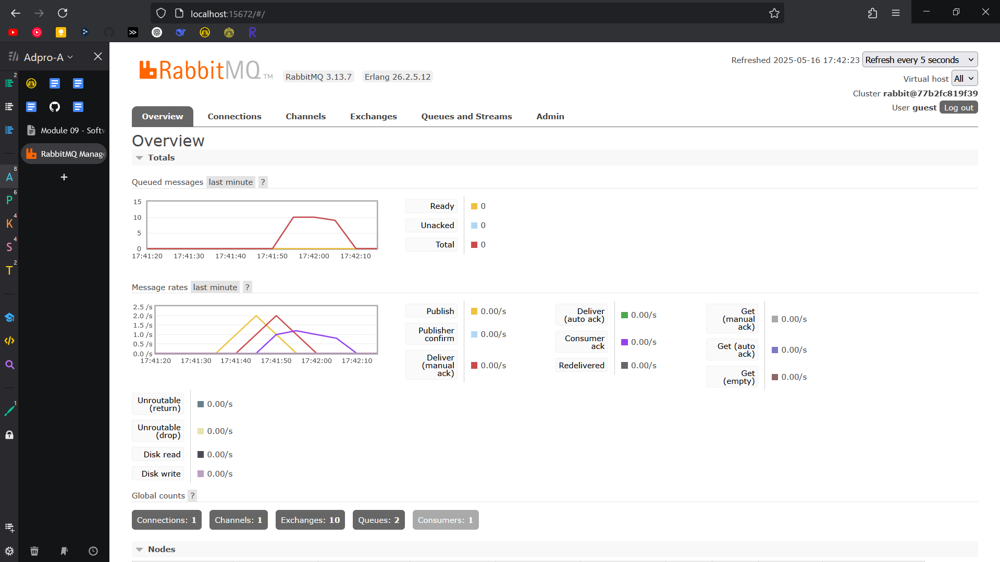
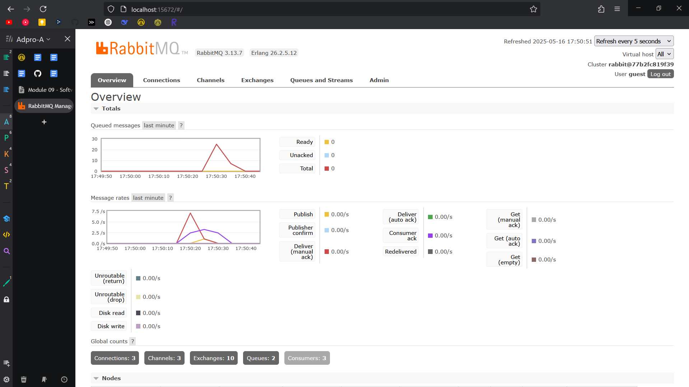

Nama : Arief Ridzki Darmawan

NPM : 2306210115

Kelas : A

---
## 1.
### > Apa itu amqp?
AMQP (Advanced Message Queuing Protocol) adalah protokol messaging yang digunakan untuk komunikasi antara beberapa sistem menggunakan message queues dan sering digunakan pada arsitektur event-driven atau microservices. Sifatnya adalah asinkronus.

### > Apa yang dimaksud dengan ```guest:guest@localhost:5672```? siapa guest pertama dan kedua, dan buat siapa ```localhost:5672``` ini?
* guest pertama => username (defaultnya guest)
* guest kedua => password (defaultnya juga guest)
* localhost => alamat host AMQP, localhost berarti servernya di mesin yang sama
* 5672 => port number yang digunakan AMQP (RabbitMQ secara default listen ke port 5672)

### > Mensimulasikan subscriber lambat

Alasan mengapa total queue di mesin saya 10 adalah mungkin karena saya kurang cepat menjalankan ```cargo run``` sehingga beberapa message dari ```cargo run``` sebelumnya sudah diproses dan queue yang terbentuk tidak besar.

### > Menjalankan tiga subscriber sekaligus

Alasan mengapa lonjakan/spike pada message queue lebih cepat habis jika ada 3 subscriber yang berjalan bersamaan adalah karena ketiga subscriber menggunakan queue yang sama, dan RabbitMQ menggunakan "work queue" yang artinya queue akan load-balancing ke seluruh subscriber. Tiga message dapat dikirimkan ke masing-masing subscriber secara paralel, sehingga pengiriman semua message dapat selesai tiga kali lipat lebih cepat daripada mengirimkan hanya pada 1 subscriber.

Perbaikan yang dapat dilakukan adalah dengan menghapus ```thread:sleep``` dan menambahkan concurrency pada subscriber.